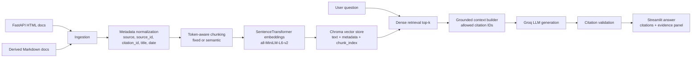

# Architecture Diagram

The production configuration uses fixed token chunks with `chunk_size=256` and `overlap=50` because this setting had the best measured retrieval result in the current evaluation.
